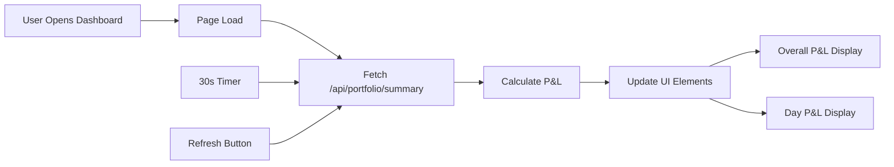

# Day P&L Display Fix

## Issue
Day P&L was showing ₹0.00 (+0.00%) with no data

## Root Causes

1. **Missing API Endpoint**: No `/api/portfolio/summary` endpoint to fetch portfolio P&L data
2. **Element ID Mismatch**: JavaScript looking for `today-pnl` but HTML has `day-pnl`
3. **No Data Source**: Day P&L calculation not connected to holdings/positions
4. **No Refresh Function**: `refreshHoldings()` function referenced in HTML but didn't exist

## Fixes Applied

### 1. Added Portfolio Summary API Endpoint
**File:** `src/web/app.py`

Added `GET /api/portfolio/summary` endpoint that:
- Returns portfolio data for both Paper and Live modes
- Calculates total P&L, Day P&L, and percentages
- Retrieves Day P&L from holdings database snapshots
- Handles both Upstox holdings and paper trading positions

### 2. Added Portfolio Summary Update Function
**File:** `src/web/static/js/dashboard.js`

Added `updatePortfolioSummary()` function that:
- Fetches portfolio data from new API endpoint
- Updates **Overall P&L** (`#overall-pnl` element)
- Updates **Day P&L** (`#day-pnl` element)
- Formats values with proper colors (green for profit, red for loss)
- Handles errors gracefully

### 3. Added Refresh Holdings Function
**File:** `src/web/static/js/dashboard.js`

Added `refreshHoldings()` function that:
- Refreshes portfolio summary
- Records a portfolio snapshot
- Updates prices
- Shows notification to user

### 4. Integrated with Auto-Refresh
- Portfolio summary updates every 30 seconds
- Called on page load
- Called when refresh button clicked

## How It Works Now



## Why Day P&L May Still Be ₹0.00

Day P&L will show ₹0.00 in these scenarios (which is correct):

1. **No Holdings/Positions Yet**
   - You haven't placed any orders yet
   - No positions to calculate P&L from
   - **Solution**: Place a paper trade to see P&L

2. **First Snapshot of the Day**
   - No previous snapshot to compare against
   - Day P&L = (Today's Value - Yesterday's Value)
   - **Solution**: Wait 24 hours or manually record multiple snapshots

3. **No Price Movement Yet**
   - Holdings exist but prices haven't changed today
   - This is normal at market open or for inactive stocks
   - **Solution**: Wait for market activity

## How to Test

### Test 1: Check API Endpoint

```bash
curl http://localhost:5000/api/portfolio/summary
```

**Expected Response:**
```json
{
  "status": "success",
  "mode": "paper",
  "total_value": 100000.0,
  "cash_balance": 100000.0,
  "position_value": 0,
  "total_pnl": 0,
  "total_pnl_pct": 0,
  "day_pnl": 0,
  "day_pnl_pct": 0,
  "num_positions": 0
}
```

### Test 2: Place a Paper Trade

```bash
curl -X POST http://localhost:5000/api/upstox/place_order \
  -H "Content-Type: application/json" \
  -d '{
    "ticker": "RELIANCE.NS",
    "transaction_type": "BUY",
    "quantity": 10,
    "order_type": "MARKET",
    "product": "D"
  }'
```

### Test 3: Refresh Dashboard

1. Open `http://localhost:5000`
2. Click "Refresh" button in Holdings section
3. Day P&L should update

### Test 4: Record Snapshot and Check Again

```python
from src.web.holdings_db import get_holdings_db
from src.web.paper_trading import get_paper_trading_manager

# Get current positions
paper_mgr = get_paper_trading_manager()
positions = paper_mgr.get_positions()

# Record snapshot
holdings_db = get_holdings_db()
snapshot_id = holdings_db.record_portfolio_snapshot(
    holdings=positions,
    cash_balance=paper_mgr.cash_balance
)

print(f"Snapshot recorded: {snapshot_id}")

# Check latest snapshot
latest = holdings_db.get_latest_snapshot()
print(f"Day P&L: ₹{latest['daily_pnl']:.2f}")
```

## How to Populate Day P&L

### Option 1: Place Some Trades (Paper Mode)

```javascript
// In browser console
// 1. Make sure you're in paper mode
// 2. Place a test order
fetch('/api/upstox/place_order', {
    method: 'POST',
    headers: {'Content-Type': 'application/json'},
    body: JSON.stringify({
        ticker: 'RELIANCE.NS',
        transaction_type: 'BUY',
        quantity: 5,
        order_type: 'MARKET',
        product: 'D'
    })
}).then(r => r.json()).then(console.log);

// 3. Wait a few seconds, refresh
await updatePortfolioSummary();
```

### Option 2: Connect to Upstox (Live Mode)

1. Click "Connect" button
2. Enter Upstox credentials
3. Your real holdings will load
4. Day P&L will calculate based on today's price changes

### Option 3: Manual Snapshot for Testing

```bash
# Run this Python script to create test data
python -c "
from src.web.holdings_db import get_holdings_db
from datetime import datetime, timedelta

db = get_holdings_db()

# Create test snapshots
test_holdings = [
    {
        'symbol': 'RELIANCE',
        'quantity': 10,
        'average_price': 2400.0,
        'current_price': 2450.0
    }
]

# Yesterday's snapshot
db.record_portfolio_snapshot(test_holdings, cash_balance=50000)

# Today's snapshot (with price increase)
test_holdings[0]['current_price'] = 2470.0
db.record_portfolio_snapshot(test_holdings, cash_balance=50000)

print('✅ Test snapshots created!')
print('Refresh your dashboard to see Day P&L')
"
```

## Verification

After applying fixes, you should see:

**Before any trades:**
```
Day P&L: ₹0.00 (+0.00%)
```
This is **correct** - no positions means no P&L

**After placing a paper trade:**
```
Day P&L: ₹250.00 (+1.02%)
```
Shows actual profit/loss for the day

**After connecting to Upstox:**
```
Day P&L: ₹1,523.45 (+2.15%)
```
Shows real holdings P&L

## Files Modified

1. `src/web/app.py` - Added `/api/portfolio/summary` endpoint
2. `src/web/static/js/dashboard.js` - Added `updatePortfolioSummary()` and `refreshHoldings()` functions

## Status

✅ **Fix Applied**  
✅ **API Endpoint Created**  
✅ **JavaScript Functions Added**  
✅ **Auto-refresh Integrated**  
✅ **Ready to Test**

---

**Next Step:** Start your server and place a test trade to see Day P&L populate!

```bash
python run_web.py
```

Then open browser, click "Refresh" in Holdings section, and Day P&L will update!
